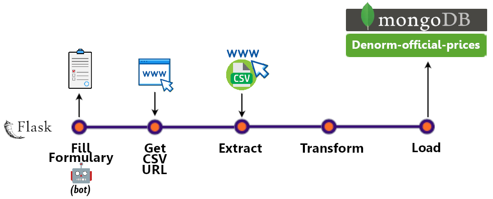
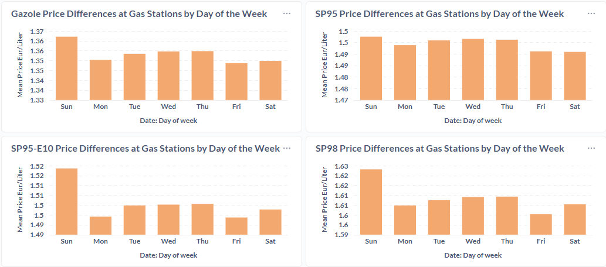

# Datapipeline Compare Official vs Gas Stations Oil Prices

[](https://www.linkedin.com/in/gaetancorin/)

This project processes **56 million records** of **oil prices changes** from French gas stations (2008 → today), and compares them with official government oil prices to analyze pricing differences.

### Tech Stack
- **Python** (ETL, data cleaning, automation)  
- **Flask** (API & scheduling)  
- **MongoDB** (storage & denormalization)  
- **Metabase** (visualization & dashboards)  
- **Amazon S3 / IAM** (backup & restoration)  
- **Pandas** (data transformation & aggregation)  
- **Selenium** (web scraping and automation for government data)

## Global Architecture


## Data Pipelines
A **daily Flask server** orchestrates two ETL pipelines feeding **MongoDB**:

### Gas Station Data Pipeline
- Extraction, cleaning, anomaly filtering (**standard deviation + Z-score**), and structuring into two collections (`stations_infos` and `stations_prices`).  
- Data is then **denormalized** into a **daily average price per oil type** across all stations to match the format of the official data.  
- Results are loaded into **MongoDB**.


### Official Data Pipeline
- An **automated bot fills the government form** to generate the URL for downloading the CSV (the URL changes daily).  
- Extract the CSV data using the URL, then **transform and load it into MongoDB** (data is already denormalized by the government into **weekly averages** per oil type).



##  Visualizations

### Data comparaisons
Data is analyzed in **Metabase**, which compares **observed daily oil prices** (gas stations data) with **official weekly oil prices** (official government data) to visualize differences.


### Daily patterns

Additional analysis identifies **daily price patterns in gas station data**, which are not visible in the weekly government data.



## Backup & Redeployment
Two **Flask servers** manage infrastructure tasks with **S3 storage**:

- **`project_ETL` server**: Handles ETL processing as well as **MongoDB dumps and restoration** to Amazon S3 using APIs.  
- **`project_METABASE` server**: Handles **Metabase dashboard backup and redeployment** to S3 via the API, ensuring all dashboards (charts, reports) are safely stored and restorable.

# Getting Started

This project is designed as a proof of concept to showcase my data engineering skills. 

### Pre-requisites

* **MongoDB** installed and running
* [**MongoDB Command Line Database Tools**](https://www.mongodb.com/try/download/database-tools) installed
* **Docker** and **Docker Compose**
* [**AWS S3 Account**](https://us-east-1.console.aws.amazon.com/s3/home?region=us-east-1#) and [**IAM User**](https://us-east-1.console.aws.amazon.com/iam/home#/users) with permissions:
    - s3:GetObject
    - s3:PutObject
    - s3:DeleteObject
    - s3:ListBucket


### Setup and Installation


1. **Clone this repository** on your machine  
   ```
   git clone https://github.com/gaetancorin/Datapipeline_compare_official_vs_gas_stations_oil_prices.git
   ```

2. Open the `Project_ETL` folder in your code editor and follow the instructions in the [**README**](./project_ETL/README.md) to configure and run the pipelines.


3. Open the `Project_METABASE` folder in your code editor and follow the instructions in the [**README**](./project_METABASE/README.md) to configure and deploy Metabase dashboards.
