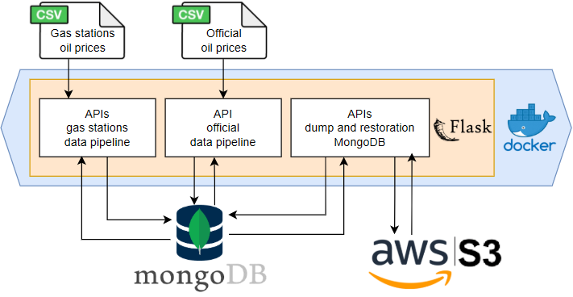

# Project_ETL

[](https://www.linkedin.com/in/gaetancorin/)

This part of the project is responsible for executing all ETL (Extract, Transform, Load) processes to load data into MongoDB, as well as handling MongoDB database dumps and restorations.

## Architecture


## Prerequisites
* **MongoDB** installed and running
* [**MongoDB Command Line Database Tools**](https://www.mongodb.com/try/download/database-tools) installed
* **Docker** installed
* [**AWS S3 Account**](https://us-east-1.console.aws.amazon.com/s3/home?region=us-east-1#) and [**IAM User**](https://us-east-1.console.aws.amazon.com/iam/home#/users) with permissions:
    - s3:GetObject
    - s3:PutObject
    - s3:DeleteObject
    - s3:ListBucket

if running locally without Docker:
* **Google Chrome**  installed (required for Selenium / browser automation)


## Project Setup

If you haven't already cloned the repository:

```
git clone https://github.com/gaetancorin/Datapipeline_compare_official_vs_gas_stations_oil_prices.git
```
Then navigate to the ETL project folder:
```
cd Datapipeline_compare_official_vs_gas_stations_oil_prices/project_ETL
```

## Environment Setup
Provide the required environment variables for the project in the env/ folder.

### ➡️ Running project_ETL in Debug Mode (Without Docker)
1. Go to the `env` folder.  
2. Copy `.env_example` to `.env`  manually.  
3. Fill in your **MongoDB credentials**, **Amazon IAM user**, and **S3 bucket information**.

This setup is useful to debug or run the Flask server directly on your machine.

### ➡️ Running project_ETL with Docker
1. Go to the `env` folder.  
2. Copy `.env_example` to `.env_prod`  manually.  
3. Fill in your **MongoDB credentials**, **Amazon IAM user**, and **S3 bucket information**.

This setup is intended for running the Flask server fully containerized through Docker.

## Running the Project
From the `Project_ETL` root folder, build and start the Docker image:
```
docker build -t project_etl .
```
Run the container:
```
docker run -d -p 5000:5000 --name project_etl project_etl
```
(check [help_docker.txt](help_docker.txt) file if need more help with docker)

## Recommended Tools & Documentation

### ➡️ API Resources  📮(Recommended)
- **Postman Collection**  
  Import the [Project_ETL.postman_collection.json](Project_ETL.postman_collection.json) file into Postman for a ready-to-use set of API requests.

- **API Documentation**  
  Detailed explanations, parameters, and usage examples of all APIs and their endpoints:  
  [API_Documentation.md](_documentation/API_Documentation.md)

### ➡️ Configuration Helper 📮(Recommended)
This [Configuration_Helper_Documentation.md](../_documentation/Configuration_Helper_Documentation.md) help to:
- **Increasing WSL memory** (to be able to load full data)
- **Managing MongoDB users & authentication**
- **Connecting MongoDB** (local or cloud) **to Metabase**

### ➡️ Data Sources
- **Gas Station & Official Government Data**  
  Comprehensive explanations of each dataset, formats, and usage:  
  [Datasources.md](_documentation/Datasources.md)


### ➡️ Functions & MongoDB Architecture
- **Pipelines functions & MongoDB Structure**  
  Full architecture of the ETL functions and MongoDB collections:  
  [Functions_And_MongoDB_Architecture.md](_documentation/Functions_And_MongoDB_Architecture.md)

### ➡️ Z-Score Visualization Notebook
- This [Z_Score_Visualization.md](./_documentation/z_score_visualisation/z_score_visualization.md) allows you to **load a notebook to visualize the data before and after the z-score transformation**, helping to understand the data cleaning process.
