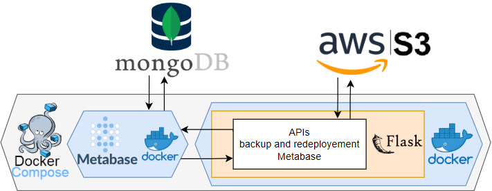

# Project_MASTER

[](https://www.linkedin.com/in/gaetancorin/)

This part of the project is responsible for loading the data currently stored in MongoDB (produced by the `Project_ETL`) and exposing it as business KPIs through Metabase dashboards. It is also responsible for backing up and restoring the Metabase dashboards configuration in an Amazon S3 bucket.

## Architecture


## Prerequisites
* **MongoDB** installed and running
* [**MongoDB Command Line Database Tools**](https://www.mongodb.com/try/download/database-tools) installed
* **Docker** installed
* [**AWS S3 Account**](https://us-east-1.console.aws.amazon.com/s3/home?region=us-east-1#) and [**IAM User**](https://us-east-1.console.aws.amazon.com/iam/home#/users) with permissions:
    - s3:GetObject
    - s3:PutObject
    - s3:DeleteObject
    - s3:ListBucket

* **Existing MongoDB data previously loaded using the `Project_ETL`**


## Project Setup

If you haven't already cloned the repository:

```
git clone https://github.com/gaetancorin/Datapipeline_compare_official_vs_gas_stations_oil_prices.git
```
Then navigate to the ETL project folder:
```
cd Datapipeline_compare_official_vs_gas_stations_oil_prices/project_METABASE
```

## Environment Setup
Provide the required environment variables for the project in the env/ folder.

### ➡️ Running project_Metabase in Debug Mode (Without Flask containerized)
1. Go to the `env` folder.  
2. Copy `.env_example` to `.env`  manually.  
3. Fill in your **Amazon IAM user**, and **S3 bucket information**.

This setup is useful to debug or run the Flask server directly on your machine.

### ➡️ Running project_Metabase with Docker
1. Go to the `env` folder.  
2. Copy `.env_example` to `.env_prod`  manually.  
3. Fill in your **Amazon IAM user**, and **S3 bucket information**.

This setup is intended for running the Flask server fully containerized through Docker.


## Running the Project
From the `Project_METABASE` root folder, build and start the Docker Compose:
```
docker-compose -p project_metabase up --build -d
```
This will:
- Build and Start the Flask API project into container
- Build and Start the Metabase into container

Metabase is now available at: http://localhost:3000 (user/password: admin@admin.com ; admin31)

(check [help_docker.txt](help_docker.txt) file if need more help with docker)

## Easy Starting
For easier testing and faster setup, a sample metabase.db file is included directly in the Flask repository.

To use it:

1. Send a POST request to the endpoint:
**/utils/restore_metabase_db_from_S3**
using Postman or any API client. ([check API Resources section right below](#️-api-resources-recommended))

2. In the request body, provide the following parameter value:
```
"zipname": "metabase_db_example"
```
3. Once the database is restored, open Metabase and check result at:
http://localhost:3000
(user/password: admin@admin.com ; admin31)

([Here is an example of the dashboards result](./_documentation/dashboard_results_easy_starting.md))

## Recommended Tools & Documentation

### ➡️ API Resources 📮(Recommended)
- **Postman Collection**  
  Import the [Project_METABASE.postman_collection.json](Project_ETL.postman_collection.json) file into Postman for a ready-to-use set of API requests.

- **API Documentation**  
  Detailed explanations, parameters, and usage examples of all APIs and their endpoints:  
  [API_Documentation.md](_documentation/API_Documentation.md)

### ➡️ Configuration Helper 📮(Recommended)
This [Configuration_Helper_Documentation.md](../_documentation/Configuration_Helper_Documentation.md) help to:
- **Increasing WSL memory** (to be able to load full data)
- **Managing MongoDB users & authentication**
- **Connecting MongoDB** (local or cloud) **to Metabase**

