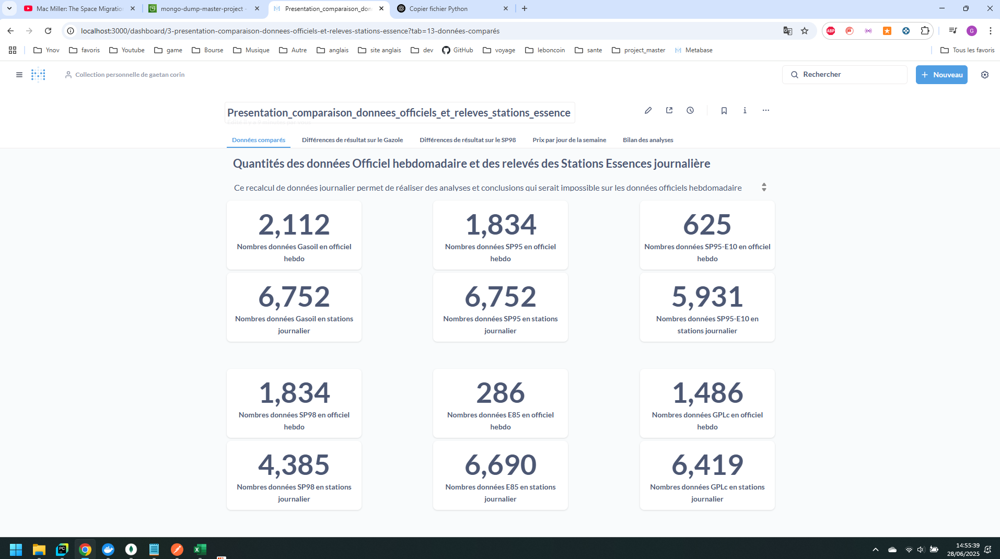
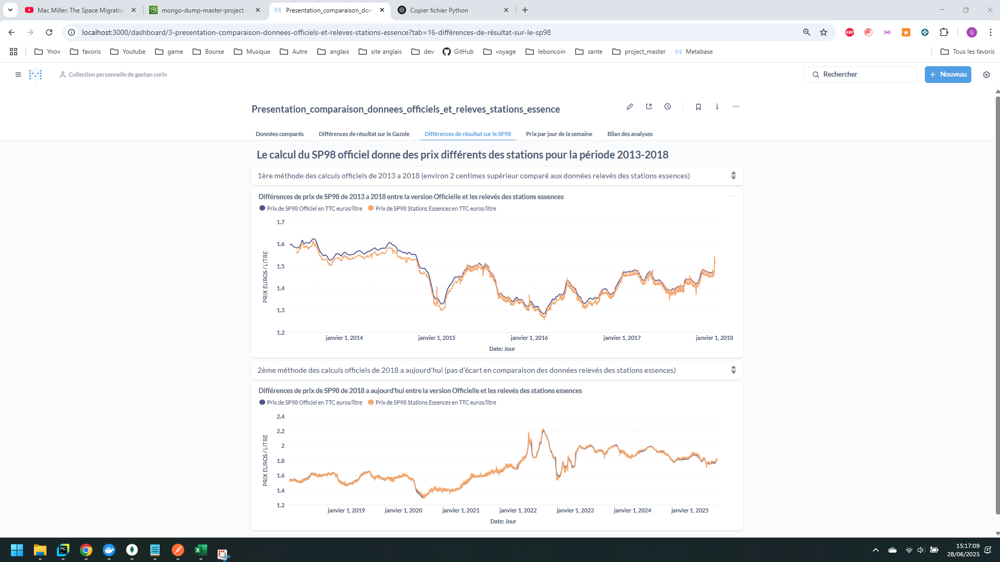
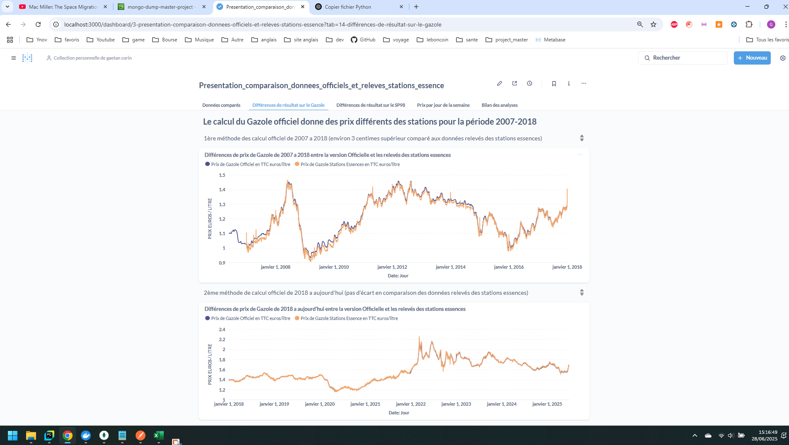
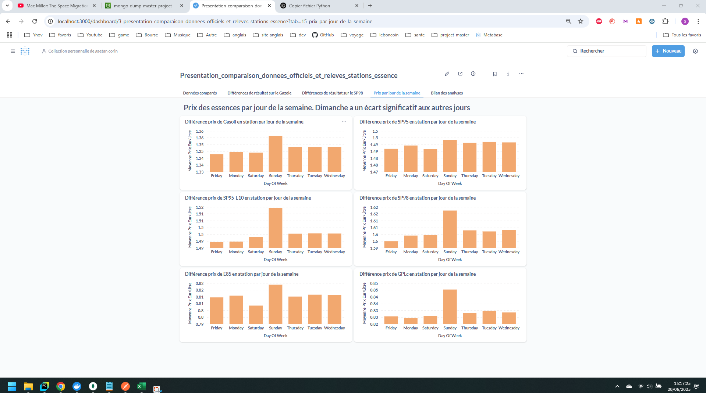
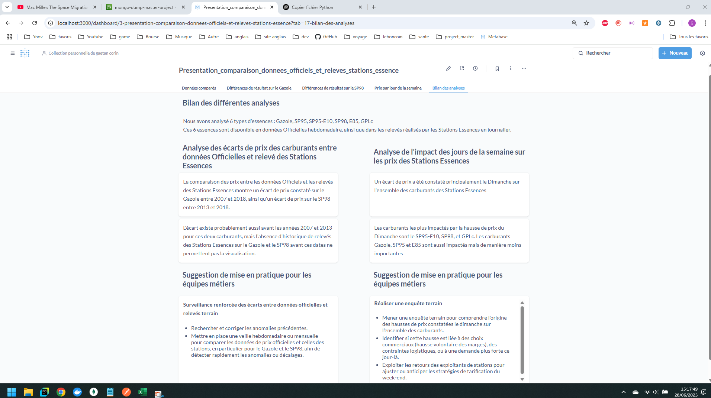

# Dashboard Results Easy Starting

This shows the results of the Metabase dashboard, available after loading data using **Project_ETL** and [importing the sample](../README.md) `metabase.db` file into Metabase container.

## Data Volume Overview

## SP98 Price Differences

## Diesel (Gazole) Price Differences

## Price Analysis by Day of the Week

## Analysis Summary
